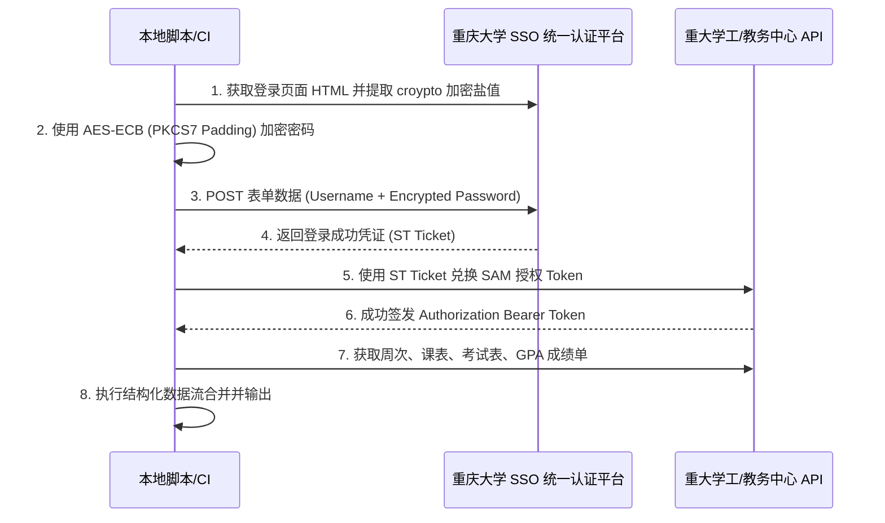

# 📅 Chongqing University Academic Data Assistant (cqu-final-score)

<p align="center">
  
  
  
  
</p>

`cqu-final-score` 是一款专为重庆大学（CQU）学生打造的高清、无侵入式学术数据自动化追踪与分析引擎。该工具能够安全、可靠地拉取教务系统的成绩单（GPA、学分、课程类别）、今日课表和近期考试安排，并在终端输出极具设计感的结构化研学报告。

---

## 🌟 核心特性

- **🔐 安全认证协议**：支持完整的统一身份认证（CQU SSO）OAuth2.0 握手流。内置高安全性 AES-ECB 动态加密，与官方前端密码加密逻辑像素级对齐。
- **📈 深度数据提取**：精细化解析 CQU 官方教务 API，自动过滤冗余信息，准确提取学期、绩点、学分及具体成绩明细。
- **📅 日程场景对齐**：支持自动推算当前教学周次，并抓取当前周内的今日课程时间段、教室占用与近期考试安排，避免上课与考试撞车。
- **🍀 隐私安全隔离**：核心密码资产全面解耦，优先通过系统环境变量输入，防止个人账号与密钥泄露到公开代码库。
- **📧 智能邮件推送（可选）**：内置与顶级邮件发送平台 **Resend** 的集成方案，支持将研学报告渲染为精美的卡片式 HTML 邮件推送至您的个人邮箱。

---

## 🚀 快速开始

### 1. 克隆并安装依赖

首先，请确保您的本地或服务器已安装 **Python 3.8+** 环境：

```bash
git clone https://github.com/Jacknie666/cqu-final-score.git
cd cqu-final-score

# 创建并激活虚拟环境（推荐）
python3 -m venv venv
source venv/bin/activate  # macOS/Linux
# venv\Scripts\activate  # Windows

# 安装核心依赖
pip install requests pycryptodome urllib3
```

### 2. 本地运行（隐私安全推荐）

我们将登录账密解耦为系统环境变量，您可以通过控制台临时传入环境变量来安全运行：

```bash
CQU_USERNAME="您的学号" CQU_PASSWORD="您的统一身份认证密码" python3 sent.py
```

*若未检测到环境变量，脚本会自动给出友好安全提示并提醒配置环境变量。*

---

## 📧 Resend 智能邮件推送配置指引

如果希望将每日学情与课表推送至邮箱，您可以使用业界广受好评的高速邮件分发平台 **Resend** 实现自动化推送。

### 步骤一：注册并获取 Resend API Key

1. 访问 [Resend 官方网站 (resend.com)](https://resend.com) 并注册账号。
2. 登录控制台后，导航到左侧菜单的 **API Keys** 页面。
3. 点击 **Create API Key**，为该 key 起一个有意义的名字（例如 `cqu-score-push`），并将生成的 `re_` 开头的密钥安全复制保存。

### 步骤二：绑定并验证发送域名（生产环境推荐）

如果您拥有个人域名（例如 `yourdomain.com`）：
1. 在 Resend控制台的 **Domains** 页面，点击 **Add Domain**。
2. 输入您的域名及所属区域，Resend 将为您提供 3 条 DNS 记录（通常为两条 `MX` 和一条 `TXT` 记录）。
3. 登录您的域名服务商（如阿里云、腾讯云、Cloudflare 等），在 DNS 解析页面将上述记录添加进去。
4. 返回 Resend 页面点击 **Verify**，待状态转为 `Verified` 后，您便可以使用 `system@yourdomain.com` 等自定义邮箱发信！

> 💡 **如果您没有域名：**
> 可以直接使用 Resend 提供的默认沙箱发信邮箱 `onboarding@resend.dev`，但发信目标地址通常仅限您的注册邮箱。

### 步骤三：在代码中启用邮件推送

恢复 `sent.py` 中被精简的邮件模块非常简单。在 `sent.py` 中安装并导入 `resend` 库：

```bash
pip install resend
```

在代码中通过以下模块进行调用发信：

```python
import resend

# 1. 注入 API Key
resend.api_key = "您的 re_ 开头的 Resend API 密钥"

# 2. 发送 HTML 格式的研学报告
resend.Emails.send({
    "from": "CQU Assistant <system@yourdomain.com>",  # 或者是 onboarding@resend.dev
    "to": ["your_qq_mailbox@qq.com"],
    "subject": "📅 重庆大学每日研学报告",
    "html": "<h1>您的学情 HTML 内容</h1>"
})
```

---

## 🛠️ 技术原理与架构演进

系统的登录认证时序及接口调用链如下：



---

## 🔒 隐私与安全声明

1. 本工具仅作为重庆大学在校学生辅助查询学情、统筹备考的**本地脚本**。
2. 您的统一身份认证用户名与密码**完全保存在本地或您自己配置的环境变量中**，本脚本绝不会收集或上传任何您的个人凭据至第三方服务器。
3. 如果您在 GitHub Actions 中配置了定时任务，请务必使用 **Repository Secrets** 来存储 `CQU_USERNAME`、`CQU_PASSWORD` 以及 `RESEND_API_KEY`，不要以任何形式在代码中提交硬编码的密码。

---

## 📄 开源许可证

本项目基于 **MIT** 开源许可证，您可以自由分发、修改 and 在闭源项目中使用，但请保留原作者版权声明。
